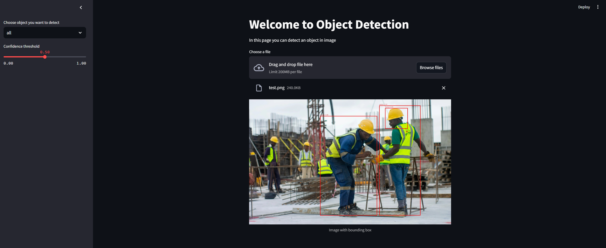

# Detect-Helmet
This repo will demonstrate how to use YOLOv10 to detect helmet

1st: install all requirement for this project

`pip install -r requirements.txt`

Now you can run the notebook to see the how to run project

